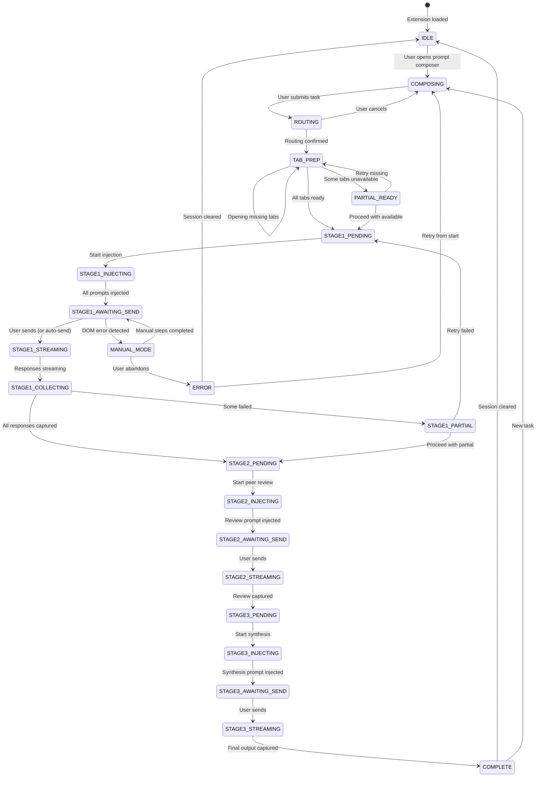

# Chrome Extension Council Process
## Adapted Multi-LLM Council Workflow for Browser Implementation

**Date**: December 31, 2025  
**Status**: Process Design  
**Context**: This document defines how the Chrome Extension orchestrates a multi-LLM council session for any user task (PRDs, code reviews, research, etc.)

---

## 📊 Process Overview (Mermaid Diagram)

```mermaid
flowchart TB
    %% ===========================================
    %% CHROME EXTENSION COUNCIL PROCESS
    %% ===========================================

    subgraph USER_INPUT["👤 USER INPUT"]
        direction TB
        U1["User enters task in<br/>Prompt Composer"]
        U2["Selects Council Type:<br/>• Full Council (4 models)<br/>• Quick Council (2-3)<br/>• Custom Selection"]
        U3["Optional: Attach files<br/>(routed to capable models)"]
        U1 --> U2 --> U3
    end

    subgraph ROUTING["🧭 INTELLIGENT ROUTING"]
        direction TB
        R1["Extension analyzes task:<br/>• Task type detection<br/>• Input size analysis<br/>• File attachment check"]
        R2["Route Recommendation:<br/>Shows 'Why this model'<br/>for each selection"]
        R3["User can override<br/>any recommendation"]
        R1 --> R2 --> R3
    end

    subgraph TAB_PREP["🔧 TAB PREPARATION"]
        direction TB
        T1["Check Model Availability:<br/>• Tab open?<br/>• Logged in?<br/>• Ready state?"]
        T2{"All tabs ready?"}
        T3["Open missing tabs<br/>+ wait for ready"]
        T4["Proceed with<br/>available models"]
        T1 --> T2
        T2 -->|Yes| STAGE1
        T2 -->|No| T3
        T3 --> T2
        T2 -->|Partial| T4
        T4 --> STAGE1
    end

    subgraph STAGE1["🎯 STAGE 1: PARALLEL CONTRIBUTIONS"]
        direction TB
        
        subgraph ADAPT["📝 ADAPTER ACTIONS (Per Model)"]
            A1["1. Focus model tab"]
            A2["2. Inject role-specific prompt<br/>(from PROMPT_TEMPLATES)"]
            A3["3. Wait at 'Awaiting Send'<br/>(User-Assisted Mode)"]
            A4["4. User reviews & clicks Send<br/>OR Auto-send if enabled"]
            A5["5. Detect streaming start"]
            A6["6. Capture response when complete"]
            A1 --> A2 --> A3 --> A4 --> A5 --> A6
        end

        S1_CLAUDE["🟣 Claude<br/>Role: Technical Analysis<br/>Status: [Awaiting Send]"]
        S1_CHATGPT["🟢 ChatGPT<br/>Role: UX/Synthesis<br/>Status: [Awaiting Send]"]
        S1_GEMINI["🔵 Gemini<br/>Role: Research/Security<br/>Status: [Awaiting Send]"]
        S1_GROK["⚫ Grok<br/>Role: Trends/Validation<br/>Status: [Awaiting Send]"]
    end

    subgraph COLLECT["📥 RESPONSE COLLECTION"]
        direction TB
        C1["Monitor all tabs for<br/>streaming completion"]
        C2["Capture responses via<br/>adapter.captureResponse()"]
        C3["Store in session state:<br/>{ model, response, timestamp }"]
        C4{"All responses<br/>collected?"}
        C5["Proceed with 3/4<br/>(user choice)"]
        C1 --> C2 --> C3 --> C4
        C4 -->|Yes| STAGE2
        C4 -->|No - Retry?| STAGE1
        C4 -->|No - Continue?| C5
        C5 --> STAGE2
    end

    subgraph STAGE2["🔍 STAGE 2: PEER REVIEW"]
        direction TB
        PR1["Compile all Stage 1<br/>responses"]
        PR2["Anonymize contributions:<br/>Response A, B, C, D"]
        PR3["Route to Review Model<br/>(Grok Expert or Claude)"]
        PR4["Inject review prompt<br/>+ all responses"]
        PR5["User sends review request"]
        PR6["Capture peer review output"]
        PR1 --> PR2 --> PR3 --> PR4 --> PR5 --> PR6
    end

    subgraph STAGE3["⚡ STAGE 3: SYNTHESIS"]
        direction TB
        SY1["Compile:<br/>• Original task<br/>• 4 Responses<br/>• Peer Review"]
        SY2["Route to Synthesis Model<br/>(ChatGPT - large context)"]
        SY3["Inject synthesis prompt"]
        SY4["User sends synthesis request"]
        SY5["Capture final output"]
        SY6["Display in Council Workspace"]
        SY1 --> SY2 --> SY3 --> SY4 --> SY5 --> SY6
    end

    subgraph OUTPUT["📤 FINAL OUTPUT"]
        direction TB
        O1["Display synthesized result<br/>with attribution"]
        O2["Export options:<br/>• Copy to clipboard<br/>• Save as Markdown<br/>• Save as JSON"]
        O3["Session complete<br/>Audit log saved"]
        O1 --> O2 --> O3
    end

    %% Main Flow
    USER_INPUT --> ROUTING
    ROUTING --> TAB_PREP
    TAB_PREP --> STAGE1
    STAGE1 --> COLLECT
    COLLECT --> STAGE2
    STAGE2 --> STAGE3
    STAGE3 --> OUTPUT

    %% Parallel indicator for Stage 1
    S1_CLAUDE ~~~ S1_CHATGPT ~~~ S1_GEMINI ~~~ S1_GROK
```

---

## 🎭 Role-Specific Prompt Templates

### Stage 1: Parallel Contributions

Each model receives a **base prompt** (the user's task) wrapped in a **role-specific system prompt**.

---

#### **Claude (Technical Architect)**

```markdown
## YOUR ROLE: Technical Architect

You are analyzing this task from a **technical implementation perspective**.

### FOCUS AREAS:
- System architecture and component design
- Code structure and patterns
- Technical feasibility and constraints
- Implementation complexity assessment
- Performance considerations

### OUTPUT FORMAT:
1. **Technical Analysis** (3-5 key points)
2. **Architecture Recommendation** (with rationale)
3. **Implementation Notes** (gotchas, dependencies)
4. **Gaps I'm NOT Covering** (defer to other specialists)

### CONSTRAINTS:
- Stay within technical domain
- Do NOT cover UX/UI design (another specialist handles this)
- Do NOT cover market validation (another specialist handles this)
- Provide concrete implementation details, not abstract theory

---

## USER'S TASK:
{USER_PROMPT}
```

---

#### **ChatGPT (UX Strategist + Synthesis Lead)**

```markdown
## YOUR ROLE: UX Strategist

You are analyzing this task from a **user experience perspective**.

### FOCUS AREAS:
- User workflow and interaction design
- Interface layout and component placement
- Error states and recovery flows
- Accessibility considerations (WCAG)
- User mental model alignment

### OUTPUT FORMAT:
1. **UX Analysis** (3-5 key user experience points)
2. **Interface Recommendation** (layouts, flows, states)
3. **Accessibility Notes** (keyboard, screen reader, color)
4. **Gaps I'm NOT Covering** (defer to other specialists)

### CONSTRAINTS:
- Stay within UX/UI domain
- Do NOT cover backend architecture (another specialist handles this)
- Do NOT cover security implementation (another specialist handles this)
- Focus on what the user sees and does

---

## USER'S TASK:
{USER_PROMPT}
```

---

#### **Gemini (Research & Security Analyst)**

```markdown
## YOUR ROLE: Research & Security Analyst

You are analyzing this task from a **research and security perspective**.

### FOCUS AREAS:
- Security threat modeling (relevant risks)
- Privacy implications and data handling
- Competitive landscape research
- Best practices and industry standards
- Potential vulnerabilities and mitigations

### OUTPUT FORMAT:
1. **Security Analysis** (relevant threats only)
2. **Privacy Considerations** (data flow, storage, consent)
3. **Research Findings** (competitive/industry context)
4. **Gaps I'm NOT Covering** (defer to other specialists)

### CONSTRAINTS:
- Stay within security/research domain
- Do NOT cover UX design (another specialist handles this)
- Do NOT cover implementation details (another specialist handles this)
- Use citations where possible (Deep Research if available)

---

## USER'S TASK:
{USER_PROMPT}
```

---

#### **Grok (Market & Trends Analyst)**

```markdown
## YOUR ROLE: Market & Trends Analyst

You are analyzing this task from a **market validation and trends perspective**.

### FOCUS AREAS:
- Current market trends and user sentiment
- Real-time community discussions (X/Twitter if available)
- User pain points and needs validation
- Competitive positioning
- Adoption barriers and drivers

### OUTPUT FORMAT:
1. **Market Analysis** (current landscape)
2. **User Sentiment** (what users want/hate)
3. **Trend Insights** (emerging patterns)
4. **Gaps I'm NOT Covering** (defer to other specialists)

### CONSTRAINTS:
- Stay within market/trends domain
- Do NOT cover technical implementation (another specialist handles this)
- Do NOT cover security details (another specialist handles this)
- Use real-time data if available (DeepSearch)

---

## USER'S TASK:
{USER_PROMPT}
```

---

### Stage 2: Peer Review

The review model receives all Stage 1 responses (anonymized) and evaluates them.

```markdown
## YOUR ROLE: Objective Peer Reviewer

You are evaluating 4 specialist contributions for the task below.
Each contribution is labeled (Response A, B, C, D) without model attribution.

### EVALUATION CRITERIA:
| Criterion | Weight | Description |
|-----------|--------|-------------|
| Technical Merit | 25% | Is it technically sound and implementable? |
| Domain Focus | 25% | Did it stay within its assigned specialty? |
| Implementation Readiness | 20% | Can this be coded/actioned directly? |
| Completeness | 15% | Did it adequately cover its domain? |
| Actionable Insights | 15% | Are recommendations specific and useful? |

### OUTPUT FORMAT:
1. **Individual Scores** (table with scores per criterion)
2. **Strengths** (what each response did well)
3. **Weaknesses** (gaps or overreach in each response)
4. **Conflicts** (where responses contradict each other)
5. **Synthesis Recommendations** (what to prioritize in final output)

### CONSTRAINTS:
- Be objective - judge the content, not the source
- Identify overlaps and conflicts explicitly
- Recommend which elements should be prioritized

---

## ORIGINAL TASK:
{USER_PROMPT}

---

## RESPONSE A (Contribution 1):
{RESPONSE_A}

## RESPONSE B (Contribution 2):
{RESPONSE_B}

## RESPONSE C (Contribution 3):
{RESPONSE_C}

## RESPONSE D (Contribution 4):
{RESPONSE_D}
```

---

### Stage 3: Synthesis

The synthesis model combines all inputs into a unified output.

```markdown
## YOUR ROLE: Synthesis Chairman

You are creating the final unified output from a multi-LLM council deliberation.

### YOUR INPUTS:
1. **Original Task**: What the user wanted
2. **4 Specialist Contributions**: Technical, UX, Security/Research, Market
3. **Peer Review**: Objective evaluation of all contributions

### YOUR PROCESS:
1. Extract the best elements from each contribution
2. Resolve any conflicts identified in the peer review
3. Synthesize into a single cohesive document
4. Attribute key decisions to their source contribution

### OUTPUT FORMAT:
Create a unified document that:
- Addresses the original task comprehensively
- Integrates technical, UX, security, and market perspectives
- Clearly attributes which contribution informed which section
- Resolves conflicts with explicit reasoning
- Provides actionable next steps

### CONSTRAINTS:
- Do NOT add new ideas not present in the contributions
- Do NOT omit critical points from any contribution
- Maintain clear attribution (e.g., "Per Technical Analysis: ...")
- Keep output structured and scannable

### EXTENDED THINKING:
Use extended thinking/reasoning for:
- Conflict resolution between contributions
- Prioritization decisions
- Structural organization

---

## ORIGINAL TASK:
{USER_PROMPT}

---

## CONTRIBUTION 1 (Technical Architect):
{RESPONSE_CLAUDE}

## CONTRIBUTION 2 (UX Strategist):
{RESPONSE_CHATGPT}

## CONTRIBUTION 3 (Research & Security):
{RESPONSE_GEMINI}

## CONTRIBUTION 4 (Market & Trends):
{RESPONSE_GROK}

---

## PEER REVIEW:
{PEER_REVIEW}
```

---

## 🔄 State Machine Definition



---

## 📋 Side Panel Status Display

The Side Panel shows real-time council status:

```
┌─────────────────────────────────────────┐
│  🏛️ COUNCIL WORKSPACE                  │
├─────────────────────────────────────────┤
│  📝 Current Stage: STAGE 1 - PARALLEL   │
│  ━━━━━━━━━━━━━━━━━━━━━ 25%             │
├─────────────────────────────────────────┤
│                                         │
│  MODEL ROSTER                           │
│  ┌───────────────────────────────────┐  │
│  │ 🟣 Claude      [Awaiting Send]    │  │
│  │   Role: Technical Architect       │  │
│  │   [Review Prompt] [Open Tab]      │  │
│  ├───────────────────────────────────┤  │
│  │ 🟢 ChatGPT    [Ready]             │  │
│  │   Role: UX Strategist             │  │
│  │   [Inject Prompt] [Open Tab]      │  │
│  ├───────────────────────────────────┤  │
│  │ 🔵 Gemini     [Streaming...]      │  │
│  │   Role: Research & Security       │  │
│  │   [View Response] [Open Tab]      │  │
│  ├───────────────────────────────────┤  │
│  │ ⚫ Grok       [Complete ✓]        │  │
│  │   Role: Market & Trends           │  │
│  │   [View Response] [Open Tab]      │  │
│  └───────────────────────────────────┘  │
│                                         │
│  ⚡ NEXT ACTION:                        │
│  Click "Send" in Claude tab to proceed  │
│                                         │
│  [Proceed with 3/4] [Retry Pending]     │
│                                         │
├─────────────────────────────────────────┤
│  📊 Session Timeline                    │
│  10:23:01 - Council started             │
│  10:23:05 - 4 prompts injected          │
│  10:23:12 - Grok: Send clicked          │
│  10:23:45 - Grok: Response captured     │
│  10:24:01 - Gemini: Send clicked        │
└─────────────────────────────────────────┘
```

---

## ⚠️ Error Recovery Flows

### DOM Change Detected
```
┌─────────────────────────────────────────┐
│ ⚠️ ERROR: Claude UI Changed             │
├─────────────────────────────────────────┤
│ The Claude interface has changed and    │
│ we couldn't find the input field.       │
│                                         │
│ RECOVERY OPTIONS:                       │
│ ┌─────────────────────────────────────┐ │
│ │ [📋 Copy Prompt to Clipboard]       │ │
│ │ Paste manually into Claude          │ │
│ ├─────────────────────────────────────┤ │
│ │ [🔄 Retry with Fallback Selectors]  │ │
│ │ Try alternative DOM detection       │ │
│ ├─────────────────────────────────────┤ │
│ │ [➡️ Proceed Without Claude]         │ │
│ │ Continue with 3/4 models            │ │
│ └─────────────────────────────────────┘ │
│                                         │
│ [Cancel Session]                        │
└─────────────────────────────────────────┘
```

### Tab Closed Mid-Session
```
┌─────────────────────────────────────────┐
│ ⚠️ ERROR: Gemini Tab Closed             │
├─────────────────────────────────────────┤
│ The Gemini tab was closed before        │
│ we could capture the response.          │
│                                         │
│ RECOVERY OPTIONS:                       │
│ ┌─────────────────────────────────────┐ │
│ │ [🔄 Reopen & Retry]                 │ │
│ │ Open new tab and re-inject prompt   │ │
│ ├─────────────────────────────────────┤ │
│ │ [➡️ Proceed Without Gemini]         │ │
│ │ Continue with responses we have     │ │
│ └─────────────────────────────────────┘ │
│                                         │
│ Session state preserved - no data lost  │
└─────────────────────────────────────────┘
```

---

## 🎛️ Configuration Options

### User Settings (Persist Across Sessions)

| Setting | Default | Options |
|---------|---------|---------|
| **Auto-Send Mode** | Never | Never / Ask Each Time / Preview Delay / Always |
| **Default Council Size** | Full (4) | Full (4) / Quick (2-3) / Custom |
| **Synthesis Model** | ChatGPT | Any enabled model |
| **Review Model** | Grok Expert | Any enabled model |
| **Show Routing Explanation** | Yes | Yes / No |
| **Anonymize for Review** | Yes | Yes / No |
| **Export Format** | Markdown | Markdown / JSON / Both |

### Per-Session Options

| Option | Description |
|--------|-------------|
| **Override Routing** | Select specific models for this task |
| **Skip Peer Review** | Go directly to synthesis (faster, less thorough) |
| **Skip Synthesis** | Just collect raw responses (research mode) |
| **Custom Role Prompts** | Override default role templates |

---

## 📁 Data Flow Summary

```
User Prompt
    │
    ▼
┌─────────────────────────────────────────┐
│            STAGE 1: PARALLEL            │
├─────────────────────────────────────────┤
│  Claude ──► Technical Analysis          │
│  ChatGPT ─► UX Analysis                 │
│  Gemini ──► Security/Research           │
│  Grok ────► Market/Trends               │
└─────────────────────────────────────────┘
    │
    ▼ (4 responses anonymized)
┌─────────────────────────────────────────┐
│            STAGE 2: PEER REVIEW         │
├─────────────────────────────────────────┤
│  Review Model evaluates all responses   │
│  ──► Scores + Conflicts + Recommendations│
└─────────────────────────────────────────┘
    │
    ▼ (all inputs combined)
┌─────────────────────────────────────────┐
│            STAGE 3: SYNTHESIS           │
├─────────────────────────────────────────┤
│  Synthesis Model creates unified output │
│  ──► Attributed, conflict-resolved doc  │
└─────────────────────────────────────────┘
    │
    ▼
Final Output (Markdown/JSON)
+ Audit Timeline
+ Session Export
```

---

*Process Version: 1.0*  
*Adapted from: Multi-LLM Council PRD Genesis Process*  
*Target: Browser-Council Chrome Extension*
