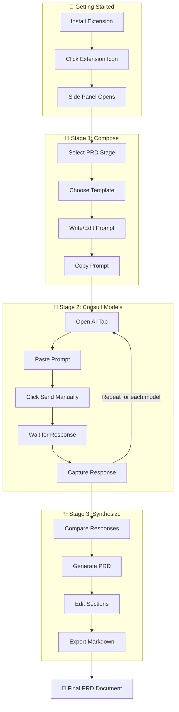
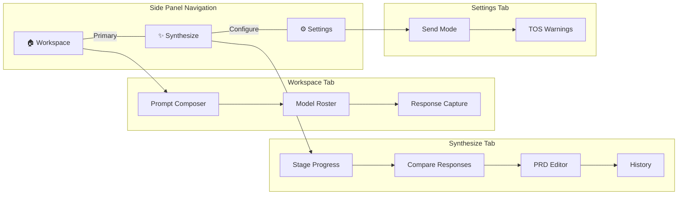
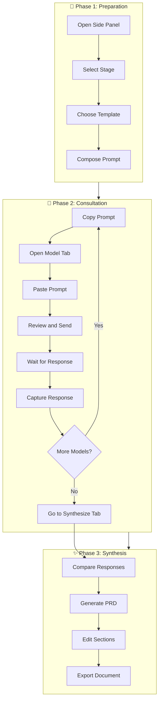
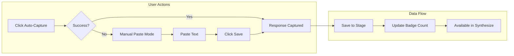
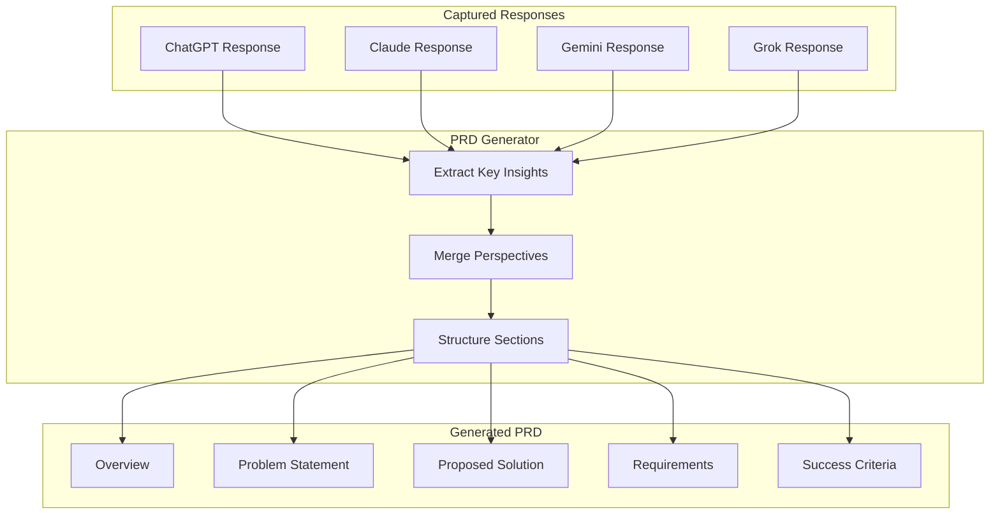
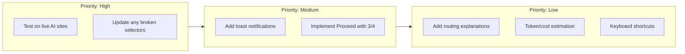

# Multi-LLM PRD Writer — Evaluator Report

**Version:** 1.2.0 | **Date:** December 31, 2025

---

## What This Extension Does

The Multi-LLM PRD Writer helps users **create better PRDs** by consulting 4 AI models (ChatGPT, Claude, Gemini, Grok) in a structured 3-stage workflow, then synthesizing their responses into a unified document.

**Core Value Proposition:**
> "Higher output quality through AI pluralism — get perspectives from 4 different models, see them side-by-side, and generate a synthesized PRD."

---

## User Journey Overview



---

## Main Navigation

The extension has a **3-tab interface**:



---

## Tab 1: Workspace

This is where users **compose prompts** and **capture responses**.

### Prompt Composer
```
┌─────────────────────────────────────────┐
│  📋 Prompt Composer                     │
├─────────────────────────────────────────┤
│  Stage: [Briefing ▼]                    │
│  Template: [Standard PRD ▼]             │
│                                         │
│  ┌───────────────────────────────────┐  │
│  │ Your prompt text here...         │  │
│  │                                   │  │
│  │                                   │  │
│  └───────────────────────────────────┘  │
│                                         │
│  245 characters                         │
│                                         │
│  [📋 Copy All] [🔄 Use Template]        │
└─────────────────────────────────────────┘
```

### Model Roster
```
┌─────────────────────────────────────────┐
│  🤖 Model Roster                        │
├─────────────────────────────────────────┤
│  ┌───────────────────────────────────┐  │
│  │ 🟢 ChatGPT          [2 📝] READY  │  │
│  │ ✓ Manual Mode • TOS Safe          │  │
│  │ [📋 Copy Prompt] [🔗 Open Tab]    │  │
│  └───────────────────────────────────┘  │
│                                         │
│  ┌───────────────────────────────────┐  │
│  │ 🟠 Claude           [1 📝] READY  │  │
│  │ ✓ Manual Mode • TOS Safe          │  │
│  │ [📋 Copy Prompt] [🔗 Open Tab]    │  │
│  └───────────────────────────────────┘  │
│                                         │
│  ┌───────────────────────────────────┐  │
│  │ 🔵 Gemini           [0 📝] READY  │  │
│  │ ✓ Manual Mode • TOS Safe          │  │
│  │ [📋 Copy Prompt] [🔗 Open Tab]    │  │
│  └───────────────────────────────────┘  │
│                                         │
│  ┌───────────────────────────────────┐  │
│  │ 🟣 Grok             [0 📝] READY  │  │
│  │ ✓ Manual Mode • Always Manual     │  │
│  │ [📋 Copy Prompt] [🔗 Open Tab]    │  │
│  └───────────────────────────────────┘  │
│                                         │
│  ╔═══════════════════════════════════╗  │
│  ║ ✨ Ready to synthesize!           ║  │
│  ║ 3 responses from 2 models         ║  │
│  ║ [Go to Synthesize →]              ║  │
│  ╚═══════════════════════════════════╝  │
└─────────────────────────────────────────┘
```

### Response Capture (per model)
```
┌─────────────────────────────────────────┐
│  ChatGPT Response                 2m ago│
├─────────────────────────────────────────┤
│  Save to stage: [📋 Briefing ▼]         │
│                                         │
│  [🎯 Auto-Capture]  [✍️ Paste]          │
│                                         │
│  ┌───────────────────────────────────┐  │
│  │ Response content preview here...  │  │
│  │                                   │  │
│  └───────────────────────────────────┘  │
│                                         │
│  245 words • Stage: Briefing            │
│  [Clear] [Copy]                         │
│                                         │
│  ✓ Saved!                               │
└─────────────────────────────────────────┘
```

---

## Tab 2: Synthesize

This is where users **compare responses** and **generate PRDs**.

### Stage Progress Indicator
```
┌─────────────────────────────────────────┐
│  Synthesis Progress                     │
├─────────────────────────────────────────┤
│                                         │
│   📋          🔍          ✨            │
│ Briefing → Research → Synthesis         │
│   2/4        1/4        0/4             │
│   ●●○○       ●○○○       ○○○○            │
│                                         │
│  PRD Title: [My New PRD              ]  │
│                                         │
│  [🪄 Generate PRD]                      │
│                                         │
└─────────────────────────────────────────┘
```

### Sub-Navigation
```
┌─────────────────────────────────────────┐
│  [📊 Compare] [📄 PRD Editor] [📜 History]
├─────────────────────────────────────────┤
```

### Compare Responses View
```
┌─────────────────────────────────────────┐
│  Compare Responses                      │
├─────────────────────────────────────────┤
│  Stage: [All Stages ▼]                  │
│                                         │
│  ┌─────────┬─────────┬─────────────────┐
│  │ ChatGPT │ Claude  │ (expand/collapse)
│  ├─────────┼─────────┼─────────────────┤
│  │ 245 wds │ 312 wds │                 │
│  │         │         │                 │
│  │ Text... │ Text... │                 │
│  │         │         │                 │
│  │ [Copy]  │ [Copy]  │                 │
│  │ [Select]│ [Select]│                 │
│  └─────────┴─────────┴─────────────────┘
└─────────────────────────────────────────┘
```

### PRD Editor View
```
┌─────────────────────────────────────────┐
│  PRD Editor                             │
├─────────────────────────────────────────┤
│  "My New PRD"                           │
│                                         │
│  ┌ Overview ────────────────────────┐   │
│  │ [Edit content inline...]         │   │
│  │                                  │   │
│  └──────────────────────────── [🗑️]┘   │
│                                         │
│  ┌ Problem Statement ───────────────┐   │
│  │ [Edit content inline...]         │   │
│  │                                  │   │
│  └──────────────────────────── [🗑️]┘   │
│                                         │
│  ┌ Proposed Solution ───────────────┐   │
│  │ [Edit content inline...]         │   │
│  │                                  │   │
│  └──────────────────────────── [🗑️]┘   │
│                                         │
│  [+ Add Section]                        │
│                                         │
│  [📋 Copy to Clipboard] [⬇️ Download MD]│
└─────────────────────────────────────────┘
```

### History View
```
┌─────────────────────────────────────────┐
│  Session History                        │
│  3 stages • 5 total responses           │
├─────────────────────────────────────────┤
│                                         │
│  [🔄 Refresh] [🗑️ Clear All]            │
│                                         │
│  ┌ 📋 Briefing ─────────── 2 responses ┐│
│  │ Dec 31, 2025, 8:15 AM          ▼    ││
│  └─────────────────────────────────────┘│
│                                         │
│  ┌ 🔍 Research ─────────── 2 responses ┐│
│  │ Dec 31, 2025, 8:20 AM          ▼    ││
│  └─────────────────────────────────────┘│
│                                         │
│  ┌ ✨ Synthesis ────────── 1 response  ┐│
│  │ Dec 31, 2025, 8:25 AM          ▼    ││
│  └─────────────────────────────────────┘│
└─────────────────────────────────────────┘
```

---

## Tab 3: Settings

```
┌─────────────────────────────────────────┐
│  ⚙️ Settings                            │
├─────────────────────────────────────────┤
│                                         │
│  Send Mode                              │
│  ○ Manual (Recommended)                 │
│    Copy prompt, switch to tab,          │
│    paste, and click send yourself.      │
│                                         │
│  ○ Semi-Assisted                        │
│    ⚠️ May violate some platform TOS     │
│    Extension fills in text; you click   │
│    send. Grok remains manual always.    │
│                                         │
│  ┌───────────────────────────────────┐  │
│  │ ⚠️ TOS Notice                     │  │
│  │ Grok (xAI) TOS bans "using bots   │  │
│  │ to access" their service.         │  │
│  │ Grok is ALWAYS manual mode.       │  │
│  └───────────────────────────────────┘  │
│                                         │
│  [Save Settings]                        │
└─────────────────────────────────────────┘
```

---

## Complete Workflow Diagram



---

## Response Capture Flow



---

## PRD Generation Flow



---

## Feature Status

| Feature | Status | Notes |
|---------|--------|-------|
| Prompt Composer | ✅ | 3 stages, 3 templates |
| Copy to Clipboard | ✅ | One-click copy |
| Model Roster | ✅ | 4 models with status |
| Response Capture | ✅ | Auto + Manual modes |
| Stage Selection | ✅ | Briefing/Research/Synthesis |
| Response Comparison | ✅ | Side-by-side view |
| PRD Generation | ✅ | Auto-generate sections |
| Section Editing | ✅ | Inline edit, add, delete |
| Markdown Export | ✅ | Copy or download |
| Session History | ✅ | View/clear past sessions |
| Response Badges | ✅ | Count per model |
| Settings | ✅ | Send mode configuration |
| TOS Compliance | ✅ | Grok always manual |

---

## Gaps and Opportunities

### User-Visible Gaps

| Gap | Impact | Priority |
|-----|--------|----------|
| Proceed with 3/4 models | Medium | P1 |
| Toast notifications on errors | Low | P2 |
| Routing explanations | Low | P2 |
| Token/cost estimates | Low | P3 |

### UX Improvement Opportunities

1. Better empty states - Show guidance when no responses yet
2. Progress animations - Loading states during PRD generation
3. Keyboard shortcuts - Power user efficiency
4. Drag-to-reorder sections - PRD editor enhancement

---

## Recommended Next Steps



---

## How to Test

1. **Install**: Load `dist/` folder in `chrome://extensions`
2. **Click** the extension icon → Side panel opens
3. **Compose** a prompt in the Workspace tab
4. **Copy** and paste to each AI model
5. **Capture** responses (paste or auto-capture)
6. **Switch** to Synthesize tab
7. **Generate** PRD and export

---

*End of Evaluator Report*
